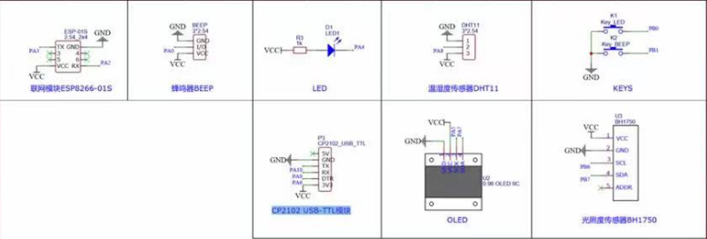
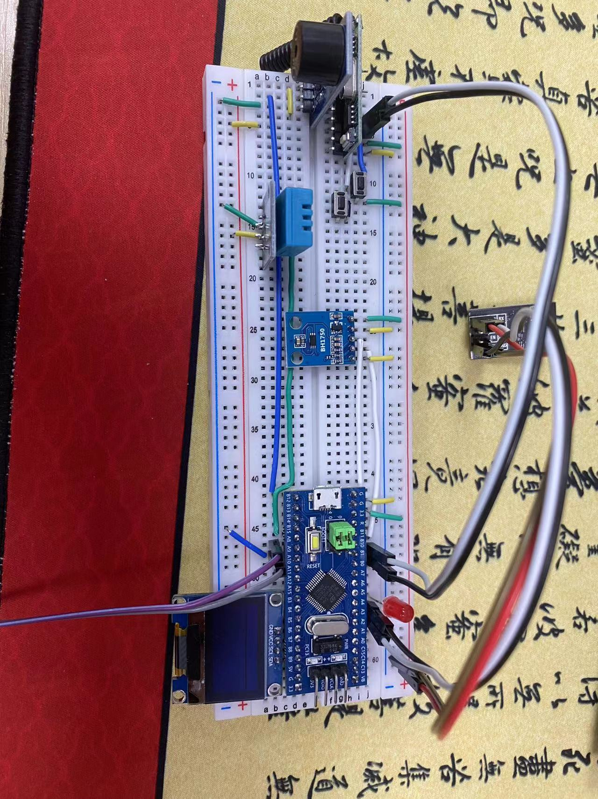
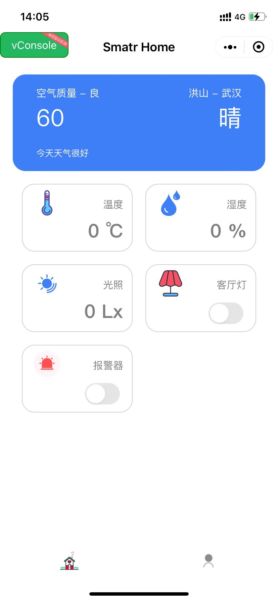

# SmartHome

智能家居&报警系统

## 硬件设备

- MCU：STM32F103C8T6
- 联网模块：ESP8266-01S
- 温湿度传感器：DHT11
- 光照传感器：BH1750
- 无线射频模块：433M
- 其他：OLED、BEEP、LED、KEY*2、USB转串口模块(CP2102)

## 接线图

### 原理图

### 实际接线图

采用面包板接线，肯定没有采用PCB板稳定。这样导致在运行中可能出现问题，例如：ESP8266-01S可能因为接线不稳定导致运行错误。

## 小程序

## 演示视频

path: ./image/演示视频.mp4

<video src="./Image/演示视频.mp4"></video>

## 移植到FreeRTOS

该项目可以移植到freertos，进行更好的任务管理。

当前已经完成初步移植，见本仓库Free-rtos分支

当然初步移植还存在一些问题，但是可以勉强正常运行，只是可能出现一些bug。后续有时间再完善freertos版本。